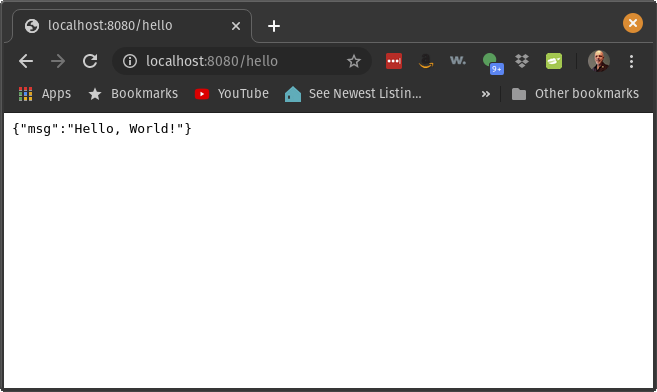
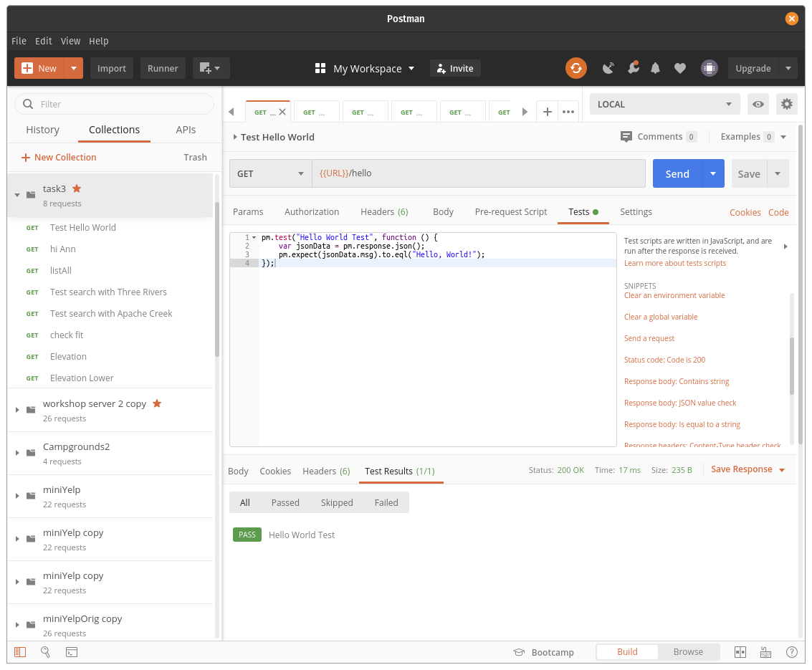
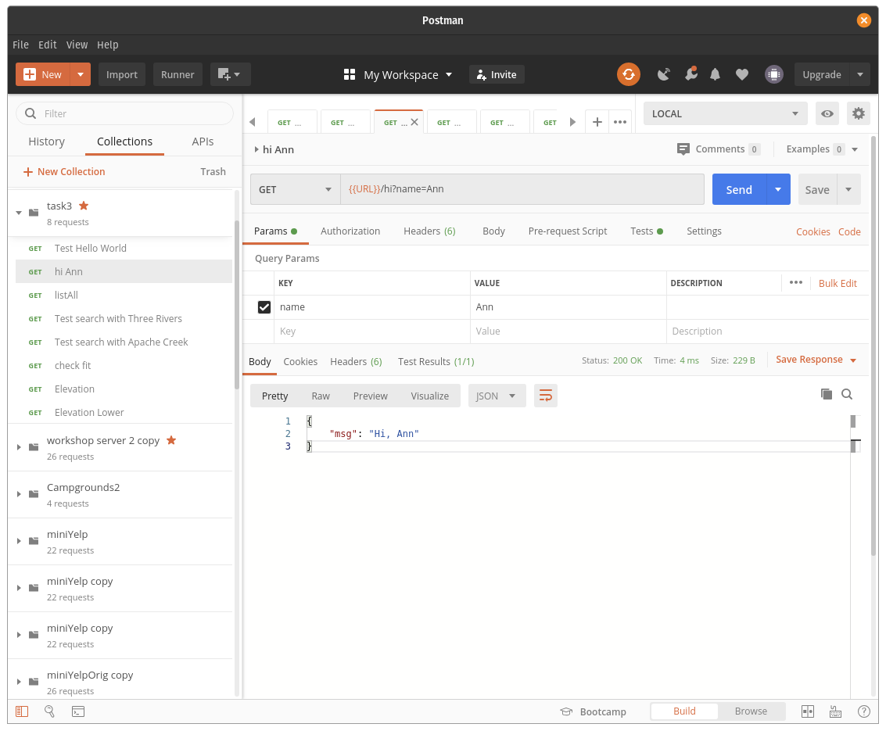

# Task 3. Your first node server


In the Basic Server and Postman units of the Nodejs module, you learned how to 


* write simple get requests
* write post requests
* test your backend server using Postman

  


This task is designed to help you practice these skills. There are a lot of bits and pieces to this task, but no single piece is that difficult. When you complete this task you will have confidence that you have the essential prerequisites to complete future tasks.


## The steps

### Step 1 clone the code

The files we need are in the same folder as this readme file.  The easiest way to obtain the files is to clone the entire repository

`git clone https://github.com/zacharski/database-course.git`

For the gitlab lab we created our own git repository. We want to copy the task2 folder that was part of the repository we just cloned, to our db-class repository in the practice folder.  For example,

`cp -r tasks/task3 ~/db-class/practice`

### step 2 nvm, node, and npm installed

You should have these programs installed when you complete task1


### Step 3 Install the libraries

In your terminal, if you haven't already, change into the task3 directory. Next execute:

`npm install`

This will install the necessary libraries. 


### Step 4 the first execution

Finally we are going to run the code with 


`node server3.js`


If you followed all the steps correctly you should see:

```javascript
Find the server at http://localhost:8080

```


This means that your server is successfully running on port 8080.  Let's look at this part of the code


```javascript
/HELLO WORLD
app.get("/hello", (req, res) => {
	res.json({msg: "Hello, World!"});
});


```

The `get`part of the `apt.get` means that this is a **get** request. The "/hello" is the name of the request we are handling. In this case, we could point our browser to http://localhost:8080/hello

If instead our code was


```javascript
/HELLO WORLD
app.get("/konnichiwa", (req, res) => {
	res.json({msg: "Hello, World!"});
});


```

The name of the request now is konnichiwa and we would point our browser to http://localhost:8080/konnichiwa. So the name of the request matches what comes after the slash in a URL.  

The `res.json` indicates what the server sends back to the client. So in this example, it sends back the json `{msg: "Hello, World!"}`We can try this is a browser:





### Step 5 provided code

Instead of interacting with the server using our browser we are going to use Postman, which allows us to test our backend code. In the Postman lesson we learned how to load a collection file into Postman. Now, let's load the `task3.postman_collection.json` that is in the task3 folder. Once that is complete we will have a collection called task3. The first request in that collection is called *Test Hello World*. Let's run that by selecting it and clicking on the send button. We see something like the following:




I clicked on the Test and Test Results tabs on the top and bottom.  If we think our code is correct but we don't pass the tests it is helpful to look at the code for the tests. In this case we can see that the test expects a key named `msg` with the value `Hello, World`. In the bottom pane, we see our code matched the test. 

server3.js also handles 2 other requests correctly.  

One is called hi:


```javascript
// Hi with one parameter, name 
//
app.get("/hi", (req, res) => {
    res.json({msg: `Hi, ${req.query.name}`});
});

```

As you can see it is a get request named `hi` and it takes one parameter named `name`. If someone wanted to use this request from their browser they would enter a URL like: http://localhost:8080/hi?name=Ann  So after the slash we see the name of the get request, `hi` then a question mark with a key/value pair. The name of the key is `name` and the value of the key is `Ann`  As before the `res.json`is used by the server to send a response back to the client. In this case it sends the json  shown in the code above. `req.query.name` is replaced with the value of the key named `name` of the query parameter (query) of the request (req). We can run the *hi Ann* request in Postman:





We are looking at the Params tab in the top pane. That shows the key, value pairs of the parameters. We see there is one key called *name* with the value *Ann*. We also see that our code passed the test *Test Results (1/1)*.


The final working request in our code is the listAll one. Here is the associated code from server3.js


```javascript
/*
List All get request. No Parameters,ype:   
    {"campgrounds":["Three Rivers Petroglyph Site",
                    "Baca Campground",
                    "South Fork Campground",
                    "Valley of Fires Recreation Area",
                    "Oak Grove Campground",
                    "Three Rivers Campground",
                    "Silver Campground",
                    "Springtime Campground",
                    "Bear Trap Campground",
                    "Datil Well Campground",
                    "Apache Creek"]}

*/
app.get("/listAll", (req, res) => {
    res.json({campgrounds: campgrounds.map((entry) => {return entry.name})});
});

```


 When we run the associated Postman query we see that it passed all the tests.


### Step 6 search get request

Now we reach a request that is incomplete, the /search one.  When we run the code in Postman we get


We see it fails all tests. Your task is to complete the code in `server3.js` so it passes the tests. 

.


### Step 7 fit

Next, we need to complete the fit get request. Our data consists of information about campgrounds including the maximum length RV that can fit. Some RVs are small 21 foot vans but other can be 35 feet or more. Not all campgrounds can fit those larger RVs. That is what this fit get request does. it takes one parameter called `length` and it returns a json object that lists the campgrounds that can accommodate that RV.

```javascript
 {
    "campgrounds": [
        {
            "campground": "Three Rivers Petroglyph Site",
            "location": "Lincoln, NM",
            "maxLength": 25
        },
        {
            "campground": "Baca Campground",
            "location": "Lincoln, NM",
            "maxLength": 32
        },
        {
            "campground": "Valley of Fires Recreation Area",
            "location": "Carrizozo, NM",
            "maxLength": 38
        },
        {
            "campground": "Oak Grove Campground",
            "location": "Alto, NM",
            "maxLength": 25
        },
        {
            "campground": "Three Rivers Campground",
            "maxLength": 25
        },
        {
            "campground": "Silver Campground",
            "location": "Cloudcroft, NM",
            "maxLength": 30
        },
        {
            "campground": "Datil Well Campground",
            "location": "Datil, NM",
            "maxLength": 35
        }
    ]
   }

```

Again, test your code with Postman

### Step 8 elevation

Sometimes when the weather is hot, you want to camp at a higher elevation for the cooler weather.  For example, right now it is 104 F in Las Cruces New Mexico which is a bit over 4000 in elevation. In Cloudcroft, a bit over an hour away and at 8675, it is 74. We want a get request called elevation that takes two parameters:


* altitude:  the elevation specified by the user 
* direction: can be either the strings 'higher' or 'lower'


The interpretation of this is as follows. If the request is


​        /elevation?altitude=8000&direction=higher

​    

​    then the request should return all camggrounds higher than 8000 feet:


```javascript
    {
    "campgrounds": [
        {
            "campground": "Oak Grove Campground",
            "elevation": 8464,
            "town": "Alto, NM"
        },
        {
            "campground": "Silver Campground",
            "elevation": 8956,
            "town": "Cloudcroft, NM"
        },
        {
            "campground": "Bear Trap Campground",
            "elevation": 8497,
            "town": "Magdalena, NM"
        }
    ]
}
```


 


### Step 9 push your code to your github repository. 

Again, make sure your `.gitignore` file includes `.env` and `node_modules` If you did everything correctly neither should be in your github folder.


### Step 10 notify the instructor 

